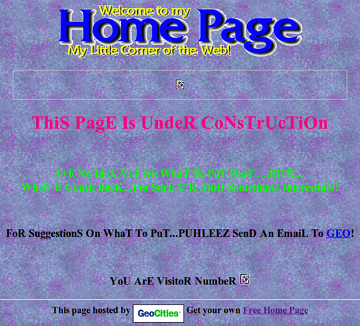
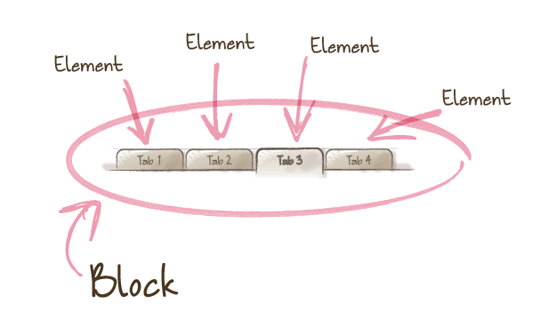
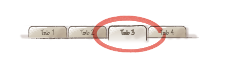
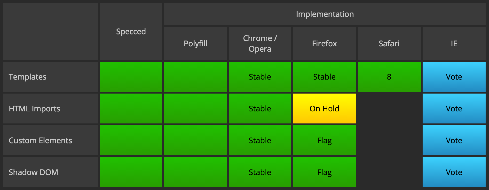
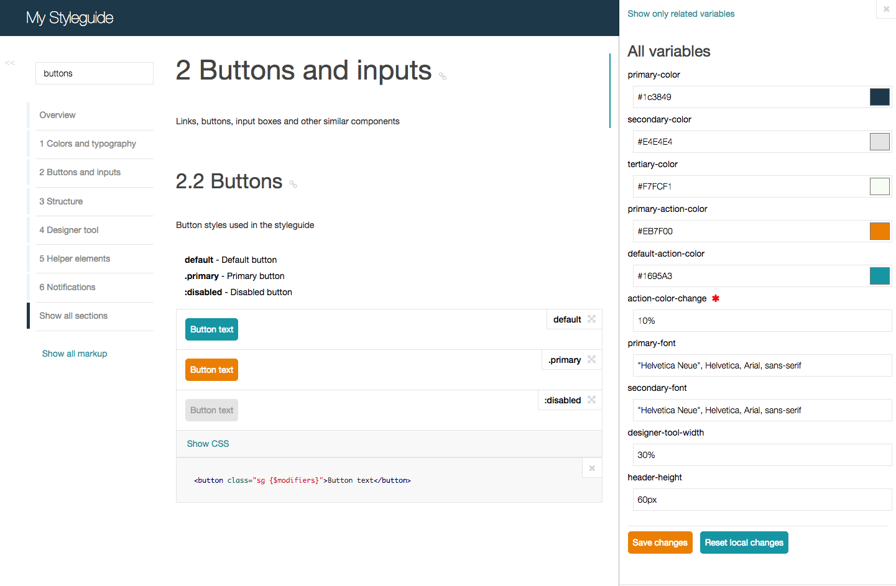

---

layout: default

style: |

  .slide p {
    margin-bottom: 24px;
  }

  .slide h3 {
    font-size: 30px;
    font-weight: bold;
  }

  .slide blockquote cite {
    font-weight: 700;
  }

  .slide table th,
  .slide table td {
    background: none;
  }

  .slide pre code {
    background-color: #efefef;
    padding: 0.5em;
    line-height: 1.5em;
    font-sizeL 20px;
  }

  .no-title h2 {
    display: none;
  }

  .two-codes table td {
    width: 50%;
  }

---

# Component development in CSS

*by [Varya Stepanova](http://varya.me/) from [SC5 Online](http://sc5.io/)*

<!-- This lecture is about developing web interfaces with CSS from component perspective -->

## Me
{: .no-title }

### Now
Senior Frontend Developer for SC5 Online

### Before
TMG (Amsterdam, the Netherlands); Yandex (Moscow, Russia)

###Area of expertise
Components on the web: libraries, SGDD, BEM. Techs: CSS, JavaScript, etc.

<!--
Before we start, I would like to introduce myself and explain why
this topic has been chosen.
-->

## Spoiler

* Industry challenges when developing CSS
* Today's solution for components on the web
* Web Components and the future of CSS
* Style Guide Driven Development

<!--
This is what I'm going to show today
-->

## CSS

> *Cascading Style Sheets* (CSS) is a style sheet language used for describing the look and formatting of a document
> written in a markup language. <cite>[Wikipedia](https://en.wikipedia.org/wiki/Cascading_Style_Sheets)</cite>

First published in 1996
{: .note}

<!--
The meaty part of the lecture is about CSS.
Are you familiar with this technology?

CSS is used to style web documents. CSS rules can be matched to DOM nodes and bring them view which
is descriped with CSS properties.

This concept is pretty old. CSS was first introduced in 1996. And nothing conceptually has been changed since then.
However the web now is far more complex than in 1996, so in industry we are facing the chalelngies and need a way to
overcome.
-->

## Industry challenges
{: .no-title }

<!--
In this picture you can see how the web pages used to look like. And from the architectural point of view they were
similar. The industry just did not have experience back then to provide recommendations how to build the we good.

Now things have already changed. Today, if you are developing not you cat's homepage but a serious website, it should
meet the requirements.
-->

## Bulletproof Web Desing
{: .bulletproof .no-title }

<!--
This problem was first spoken out loud by this gentelman. His name is Dan Cederholm and he is the author of the book
shown. The "Bulletproof Web Design" is a first place where the inductry needs were explained.
In was first published in 2005 and has 2 more editions since then. However this is quite mature book, I still recommend
it if you want to step in the industry level of creating web sites.
He first said that the HTML/CSS markup we produce should be stable. It should be maitainable meaning not very sensetive
to the providing changes.
So, it's not like single action - provide the code and forget about it. A developer will get back to their code to fix
something. Other developers will bring their changes into the code. And nothing should be broken in unexpected places.
-->

## Big CSS

* massive sites
* big teams of developers
* heavy UI
* long running projects

<!--
massive sites: A lot of code, thousands of lines
big teams of developers: up to hundreds of ppl, teams can grow and change
heavy UI: each piece of interface has a lot of code and logic behind
long running project: need to be maintainable
-->

## Massive web sites

* Thousands of lines of code
* A lot of files
* Many pages
{: }

* A lot of websites with common codebase
* Common corporate style

<!--
You cannot check all the pages visially for every change, so your code should be written the way which
makes it possible to predict.

A lot of websites with common codebase: repeating would be too expensive.
-->

## Big teams

* Hundreds of developers
* Growing teams
* Changing the context

<!--
Hundreds of people.
Developers need common approaches.
Communication matters.
-->

## Heavy UI
{: .heavy-ui .no-title }

<!--
This login form in the middle does not look as a massive component.
Just 2 inputs, checkbox, button.
Guess how much code is needed to represent it?
-->

## Heavy UI
{: .heavy-ui-code .no-title }

    <form class="b-mail-domik g-js" method="post" action="https://passport.yandex.com/passport?mode=auth&amp;from=mail&amp;origin=hostroot_com_nol_enter&amp;retpath=https%3A%2F%2Fmail.yandex.com">
      <i class="b-mail-domik__roof"></i>
      <table class="b-mail-domik__shadow">
        <tbody>
          <tr>
            <td class="b-mail-domik__shadow__lt">&nbsp;</td>
            <td class="b-mail-domik__shadow__t"></td>
            <td class="b-mail-domik__shadow__rt">&nbsp;</td>
          </tr>
          <tr>
            <td class="b-mail-domik__shadow__l">&nbsp;</td>
            <td class="b-mail-domik__shadow__m">
              

                

                  <label class="b-hint-input g-js" for="b-mail-domik-username11" style="display: block;">username</label>
                  
<input tabindex="1" name="login" id="b-mail-domik-username11" class="b-input__text" autocapitalize="off" autocorrect="off" aria-label="username">

                

                

                  <label class="b-hint-input g-js" for="b-mail-domik-password11">password</label>
                  
<input type="password" tabindex="2" name="passwd" id="b-mail-domik-password11" class="b-input__text" aria-label="password">

                

                
<input type="hidden" name="twoweeks" value="yes"><input type="checkbox" tabindex="3" id="b-mail-domik-permament11" class="b-mail-domik__check">&nbsp;<label for="b-mail-domik-permament11">don't remember me</label>

                
Log in<input type="submit" tabindex="4" class="b-mail-button__button" value="Log in"><a href="https://passport.yandex.com/auth/?mode=qr&amp;retpath=https%3A%2F%2Fmail.yandex.com" class="js-button-qr b-mail-button b-mail-button_default b-mail-button_button b-mail-button_grey-26px b-mail-button_26px b-mail-button_dependent"></a>

                
<a tabindex="5" class="b-mail-domik__remind js-count-click" href="https://passport.yandex.com/passport?mode=restore" data-metrika="Клики на 'Вспомнить пароль'" data-paranja="check">Forgot your password?</a>

                
<a class="b-mail-domik__social-link js-social-link" data-provider="fb"><i class="b-mail-domik__social-icon b-mail-domik__social-icon_provider_fb"></i></a><a class="b-mail-domik__social-link js-social-link" data-provider="tw"><i class="b-mail-domik__social-icon b-mail-domik__social-icon_provider_tw"></i></a><a class="b-mail-domik__social-link js-social-link" data-provider="gg"><i class="b-mail-domik__social-icon b-mail-domik__social-icon_provider_gg"></i></a>

              

            </td>
            <td class="b-mail-domik__shadow__r">&nbsp;</td>
          </tr>
          <tr>
            <td class="b-mail-domik__shadow__lb">&nbsp;</td>
            <td class="b-mail-domik__shadow__b"></td>
            <td class="b-mail-domik__shadow__rb">&nbsp;</td>
          </tr>
        </tbody>
      </table>
      
Yandex.Mail has  virus protection

    </form>

<!--
So, this is HTML.
And almost every node here needs CSS. Not one property but many.
-->

## Long running projects

* Code lives for years
* Continious development

<!--
In the web development you cannot create version 2, we provide changes little by little
So, the code should be maintainable for years
-->

##Is this good?

    H1 { color: blue }
    P EM { font-weight: bold }
    A:link IMG { border: 2px solid blue }
    A:visited IMG { border: 2px solid red }
    A:active IMG { border: 2px solid lime }

<!--
Now look at this code. Do you see something strange? Any guess?
Who would write their CSS like this?

The problem is that CSS was created to make text bold and links underlined. It ideally suited
solving these problems. In many websites developers still use CSS like.

Actually this code from [CSS level 1 specification](http://www.w3.org/TR/CSS1/). It is
very simple, was recommended in 1996. Time passed and we met new chalenges.
-->

## What makes CSS hard?

* Vertical centering
* Equal height columns
* Browser inconsistencies
* Unobvious tricks
{: .next }

<!--
Before we decide what is wrong with that peice, let's guess what is hard in CSS.

When ppl are asked, the repson is usually
- vertical centing
- making columns of equial height
- browers render CSS differently, so it takes special knowledge and work to make the interface consistent
- many solutions are unobvious tricks which needed to be memorized

But this is not true, this is easy or at least clear how to manage. You can google for all this questions.
-->

## What <b>really</b> makes CSS hard?

* Scoping
* Specificity conflicts
* Non-deterministic matches
* Dependency management
* Removing unused code

<!--
The real hard problems of CSS are here:
- No scoping. Everything is CSS is global.
- Specificity conflicts. I'll explain in detal later.
- Non-deterministic matches which naturally result from declarativeness of CSS language
- Dependency management
- Removing unused code
-->

## CSS has no scoping

    a { /* Affects all the links */
      color: red;
    }
    ul li a { /* Affects all the links in lists */
      color: green;
    }

<!--
This especially maters if you link third-party CSS.
A common problem for developing libraries or code which will be later delivered to another web site.
Everything in CSS is global, and writing good CSS is similar to writing a good program module if you only allowed to use
global variables.
This can be mixed with another CSS and applied to wrong nodes.
Writing good CSS means you has to predict the future.
-->

## Specificity

> Specificity is the means by which a browser decides which property values are the most relevant to an element and gets
> to be applied. Specificity is only based on the matching rules which are composed of selectors of different sorts.

<!--
Another problem is specificity.
Who remember what specificity is?
Ok, I will explain.
-->

## The most specific matters

    

      Text
    

<separator/>

    div#test span { color: green }
    span { color: red }
    div span { color: blue }

<!--
If a brower has 2, 3 or more rules which match the same DOM node, how it decides what are the properties to take into
work?
The order does not matter.
For every selector a browser calculates how important this set of rules is. The rule with the more specific selector
would be prioritized.
So, here we see...
-->

## How to overwrite?

    
Left floated sidebar

<separator/>

    .sidebar { /* Does is redefine `div.sidebar`?! */
      float: right;
    }
{: .next }

<separator/>

    body .sidebar { /* Overwrites 'div.sidebar {}' */
      float: right;
    }
{: .next }

<!--
When it comes to developments, specificity matters when redefining pre-given
components.

To redefine the left-floated sidebar, we would overwrite the rule.
-->

## Specificity hell
{: .no-title }

    .navbar-inverse .navbar-nav>li>a {
      color: #999;
    }

    #home-menu-container #home-menu li a {
      color: red;
    }

    body #home-menu ul li a {
      color: blue !important;
    }

<!--
People ask on Stackoverflow how to overwrite Bootsrtap
These things can be in different files
-->

##Non-deterministic matches

    #content div div {
      float: left;
    }

<!-- This can be matched to anything -->
<!-- You cannot rely on the document structure, because it contantly changes while developing -->
<!-- в момент, когда ты пишешь, ты указываешь признаки нод, на которые сматчится правило, а не точный адрес. смотри:
можно писать адрес «Rettigweg 1, 13187 Berlin", а можно «около Wollankstrasse такая боковая улица с тремя домами, и
там есть такой желтый дом, и там на втором этаже ещё балконы металлические с узорами» -->

## Dependency management
{: .dependency-management }

###No dependencies, sorry

### But what about?

    @import url('i-need-this.css');

### No, sorry again.
{: .next .sorry }

<!--
CSS was not developed as a programming language and now it still isn't. So, there is no way to declare that
one piece of CSS needs anotehr one.
OK, there is import. But this is not  aproduction solution. And assuming undeterministic matches we cannot rely on it.
-->

## Removing unused code

100 pages in projects

    .person div a {
      color: pink;
    }

Can I remove it? Will it break something? Maybe it is for a third-party HTML code?

<!--
CSS is declarative, so you cannot say what are the nodes the rules will aply to.
If you have a lot of pages you cannot remove a piece of CSS and check visually if something is broken.
Even worse with  dynamic web sites.
-->

## Where CSS is hard?
{: .no-title .hard-css }

<table><thead>

<th markdown="1">

This is not hard in CSS

</th>

<th markdown="1">

This is!

</th>

</thead><tr>

<td markdown="1">

    #sidebar ul li a {
      <mark>color: red;</mark>
      <mark>display: block;</mark>
      <mark>padding: 1em;</mark>
    }

</td>

<td markdown="1">

    <mark>#sidebar ul li a</mark> {
      color: red;
      display: block;
      padding: 1em;
    }

</td>

</tr></table>

*How do we architect encapsulated components?*
{: .next }

<!--
Writing CSS is easy. It is very easy to read and it is very likely that you can
find the tricks you need at Stackoverflow. But architechting CSS is very difficult.

We need a way to architect independent encapsulated components.
Being put into any place on the page, the components should not break anything. Also, it should not be broken
itself.
-->

## Methodologies
{: .shout }

<!--
As CSS does not provide us with the answer to the question how to do it, the developers should up
the methodologies.
The methodology does not give change into the technology. It suggest a developer how to use the
technology better.
-->

##OOCSS
{: .shout }

<!--
The first methodology proposed was OOCSS, stands for Object Oriented CSS.
-->

##Nicole Sullivan
{: .nicole }

<!--
It was in 2007, this is Nicole Sullivan, who authored it.
She worked for Yahoo and by that time she was dealing with components for Yahoo UI and was trying to
give some order to all this mess. So, she proposed to use some principles from OOP to CSS. This was in 2007.
I will not explain the detailes because I belive that this era is passed by.
But I still think that I should mentione her as a pioneer. She was a first developer who was trying to
solve it.
-->

## SMACSS
{: .shout }

<!--
Another milestone is SMACCS, which is Scalable and Modular Architecture for CSS.
This is a book, first published in 2009 but still available.
-->

##Jonathan Snook
{: .jonathan }

<!--
The author is this gentelman, Jonathan Snook. You can find his website if interested.
-->

## BEM
{: .shout }

<!--
And the last new thing appeared was BEM, stands for Block, Element Modifier.
It was created in 2009, then evoluated and had a long way to its popularity by now.
-->

## Vitaly Harisov
{: .harisov }

<!--
This is one of the main authors. Vitaly Harisov. He works for Yandex and heads the
frontend development there.
-->

## Sergey Berezhnoy
{: .veged }

<!--
Another co-author is Sergey Berezhnoy, who also works for Yandex.
O was very lucky to work with them and be a member of the BEM team, so I can tell you
a little bit more about it today.
-->

## BEM eco-system

* <mark>CSS Methodology</mark>
* JavaScript framework
* Template engine
* Building system
* Supplementary tools

<!--
Actually behind BEM there is a massive amount for JavaScript libraries, own template engine, many supplimentary tools.
Mosty these things are very local, but the CSS Methodology is a popular thing and becoming a standard all over the
world. So, I'll explain it in details.
-->

## Harry & Nicolas
{: .no-title .harry-nicolas }

### Harry Roberts
{: .harry }

###Nicolas Gallagher
{: .nicolas }

<!--
These 2 gentelmen are also important persons in the BEM community.
These are Harry Roberts from Britan and Nicolas Gallaher from USA. They had have a great role in BEM to be wide-spreaded
and become a standard.
Both are very famous developers and Harry is also the most wanted speaker for frontend conferences now.
So, if you are interested in their motivation of taking this approach, you can google for their blogs and social
networks accounts.
-->

## BEM

* Block
* Element
* Modifier

## Interface
{: .no-title .interface }

## Interface of blocks
{: .no-title .interface-blocks }

## Everything is a block
{: .no-title }

    <body class="page">

      

          
          
...

          
...

      

      

          
...

          
...

      

<!-- Blocks are marked with classes in HTML -->

## Why not...?

    <ul id="menu">
      <li>Tab 1</li>
      <li>Tab 2</li>
    <ul>

<separator/>

    #menu {
      /* styles for element */
    }

## No IDs

Someday you will need to repeat the block at the same page

## Elements
{: .elements }

## Elements markup
{: .no-title }

    

      <ul>
          <li class="<mark>tabbed-pane--tab</mark>">Tab1</li>
          <li class="<mark>tabbed-pane--tab</mark>">Tab2</li>
          <li class="<mark>tabbed-pane--tab</mark>">Tab3</li>
      </ul>
      

          ...
      

    

## CSS for an element

    .block {
      /* styles for block */
    }
      <mark>.block--element</mark> {
        /* styles for element */
      }

<!--
Elements have their own CSS classes. These classes are named so that it is clear which block the
element belongs to.
So, the idea is to encapsulate the components, its name becomes a kind of namespace and everything inside belongs to
this namespace.
Here dash-dash is used as a separator. Sometimes people use 2 underscores, but dash-dash looks like the most
common convention.
-->

## Why not...?

    <ul class="menu">
      <li class="item">Tab 1</li>
      <li class="item">Tab 2</li>
    <ul>

<separator/>

    .menu .item {
      /* styles for element */
    }

## No cascade

    

      

          <ul class="goods">
            <li class="item">
              <!--
                Remember: <mark>non-deterministic matches</mark>
                -->
            </li>
          </ul>
      

    

<!--
Poor little item does not know if it belongs to panels or to goods.
Making the selector more specific would not help, because we cannot rely on the document structure.
-->

## Modified block
{: .no-title .modified-block }

<!--
Components are similar visually and  functionally.
Good not to repeat ourselves but to reuse the code of the first component and provide some changes to it.
-->

## Modifier

    <ul class="menu <mark>menu_footer</mark>">
      <li class="menu--item">...</li>
      ...
    </ul>

<separator/>

    .menu_footer {
      font-size: 0.8em;
    }

<!--
BEM answer to this question is a modifier.
With additinal CSS clas to a block you can provide more information about view.
You can see that both block class and modifier class sit together at the same node.
-->

## CSS for a modifier
    .block {
      /* styles for block */
    }
      <mark>.block_modifier</mark> {
        /* styles for modifier */
      }
      .block--element {
        /* styles for element */
      }

## Modified element

## Element's modifier

    <ul class="menu">
      <li class="menu--item">Tab 1</li>
      <li class="menu--item <mark>menu--item_current</mark>">Tab 2</li>
      <li class="menu--item">Tab 3</li>
    </ul>

## CSS for an elements' modifier

    .block
      /* styles for block */
    }
      .block--element {
        /* styles for element */
      }
        <mark>.block--element_modifier</mark> {
          /* styles for modified element
        }
{: .css }

## Why not...?

    <ul class="menu footer">...<ul>

<separator/>

    .menu.footer { /* combined selector */
      font-size: 0.8em;
    }

## Why not...?

    <ul class="menu">
      <li class="menu--item current">Tab 2</li>
    <ul>

<separator/>

    .menu--item.current { /* combined selector */
      background-color: red;
    }

## No overspecific selectors

You would suffer when redefining

    .menu--item.current {
      background: white;
    }
    .menu_dark .menu--item {
      background: black; /* Still white, baby */
    }

## BEM & CSS preprocessors

    .block {
      /* styles for block */
      <mark>&</mark>_modifier {
        /* styles for modifier */
      }
      <mark>&</mark>--element {
        /* styles for element */
      }
    }
{: .css }

## [getbem.com](http://getbem.com/)
{: .shout }

## This is solved

* Scoping
* Specificity conflicts
* Non-deterministic matches
* Dependency management
* Removing unused code

<!--
So, this was about how the developers deal with component development in CSS now.
As you can see, CSS as a technology does not provide us a solution. So, we think up
our own way and recomendations how to use it.
But the reason of the need to use the metholodogy is drawbacks of CSS. And the right
way would be to fix the problems itself.
-->

## Web Components
{: .shout }

<!--
Here I introduce you another concept called Web Components. This is not the methodology but
a new technology, a new standard which will hopefully solve the problems we considered.
-->

## Technologies behind
{: .wc-behind }

* Shadow DOM
* Custom Elements
* HTML Templates
* HTML Imports

<!--
Web Components is not another language but some additions into already existing standards.
So, the additionas are:
- shadow DOM
- Custom elements in HTML
- HTML templates
- HTML Imports

I will show you in code what it all means.
-->

## Web Components

* [Navite component](demo/video.html)
* [Custom web component](demo/custom-button.html)
* [Templates](demo/templates.html)
* [HTML import](demo/html-import.html)

<!--
These are a few pages I prepared for the lecture which demonstrate the concept.
Let's take a look into them one by one.

1. Video page
Open code
Inspect element
Switch on Shadow DOM
Shadow DOM is DOM behind the component. Video is native component.

2. Custom web component
We can write our own components.
HTML is just <my-button>
In Shadow DOM we can see more compex structure.
This is because we can tech the browser to deal with our custom component. This teaching
goes with JavaScript.
Take into account that styles are encapsulated.

3. Templates
Easier than describe everything in JavaScript

4. HTML imports
Everything about one components can be detached into an HTML file and then linked to the page.

-->

## HTML import, library

    <!-- Import element -->
    <link rel="import" href="my-lib/google-map.html">

    <!-- Use element -->
    <google-map lat="37.790" long="-122.390"></google-map>

<!--
With HTML imports you can create your own components and use them across different websites.
Or you can use someone else's components as a library.
-->

## Are We Componentized Yet?
{: .componentized }

<!--
The concept is new and not all the browsers support.
-->

## Web Components Polyfills
{: .wc-polyfills }

* [WebComponents.org](http://webcomponents.org/)
* [X-Tag](http://www.x-tags.org/)

<!--
However we can live with Polyfills.
These are JavaScript additions which "teach" a browser to emulate the work of Web Components.
Add such a sript onto your page and you will be sure that the components work.
-->

## Make it work

    <!-- Polyfill Web Components support for older browsers -->
    <mark></mark>

    <!-- Import element -->
    <link rel="import" href="google-map.html">

    <!-- Use element -->
    <google-map lat="37.790" long="-122.390"></google-map>

## Ready-made components

* [Polymer](https://www.polymer-project.org/)
* [Google Web Components](http://googlewebcomponents.github.io/)

<!--
You can search for ready-made components. There is not that many of them, but
you can have some.
-->

## Usage examples

* [Toolbar](demo/toolbar.html)
* [Google map](demo/google-map.html)

<!--
I created a couple of examples about how the components can be used.

1. Toolbar
With linking the components simple code turns into more complex. Each element has its styles.

2. Goole Map
The component encapsulates JavaScript logic

This is all about web components

-->

## SGDD
{: .shout }

## Living Styleguides

A <b>living styleguide</b> represents UI components of your website with exact the same styles
which you use across the project.

## Style Guide Driven Development

<b>Styleguide Driven Development</b> is the practise of using the styleguide as the focal point for all front-end UI
development tasks.

## sc5-styleguide package
{: .npm-package }

    npm install sc5-styleguide

## SC5 Styleguide
{: .styleguide-page }

http://styleguide.sc5.io
{: .url }

<iframe src="http://styleguide.sc5.io/"></iframe>

## Killer features

* {: .next }CSS / SCSS / SASS / LESS
* {: .next }Related variables
* {: .next }Live editting
* {: .next }Angular directives
* {: .next }Easy to integrate

## How it works
{: .how-scheme }

    my-styles/
      atoms/
        header.sass
        menu.sass
        footer.sass
      common.sass
      index.sass
      products.sass

* CLI
* Gulp
* Grunt

Gulp Stream

  

## KSS Knyle Style Sheets
{: .kss }

    // A button suitable for giving a star to someone.
    //
    // :hover             - Subtle hover highlight.
    // .star-given        - A highlight indicating you've already given a star.
    // .star-given:hover  - Subtle hover highlight on top of star-given styling.
    // .disabled          - Dims the button to indicate it cannot be used.
    //
    // Styleguide 2.1.3.
    a.button.star{
      ...
      &.star-given{
        ...
      }
      &.disabled{
        ...
      }
    }

## Integration
{: .integration }

### Build the data

    gulp.task('styleguide:generate', function() {
      return gulp.src('*.scss') // Or *.less, or *.css
        .pipe(styleguide.generate({
            rootPath: './output',
            overviewPath: 'README.md'
          }))
        .pipe(gulp.dest(outputPath));
    });

## Integration
{: .integration }

### Apply styles

    gulp.task('styleguide:applystyles', function() {
      return gulp.src('main.scss')
        .pipe(sass({
          errLogToConsole: true
        }))
        .pipe(styleguide.applyStyles())
        .pipe(gulp.dest('./output'));
    });

## Integration
{: .integration }

### Watch the changes

    gulp.task('styleguide',
              ['styleguide:generate', 'styleguide:applystyles']);

    gulp.task('watch', ['styleguide'], function() {
      gulp.watch(['*.scss'], ['styleguide']);
    });

## Development with SC5 Styleguide

* Living overview of UI
* Quick manual testing
* Quick built-out of new pages
* Unit tests for UI
* <b>Easier designer/developer/client collaboration</b>

## Component development in CSS

* Big CSS
* BEM (SMACSS, OOCSS)
* Web Components
* SGDD

### [varya.me/component-development-css](http://varya.me/component-development-css/)

<!--
I hope this was useful
-->
